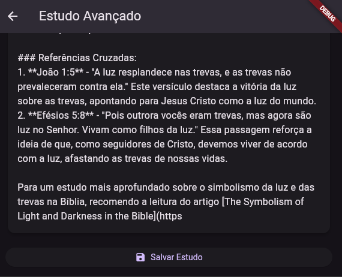
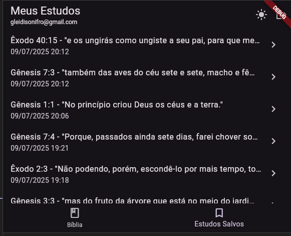

# 📖 Bíblia Estudo IA

Este aplicativo, desenvolvido em Flutter, é uma ferramenta moderna para o estudo das Escrituras. Ele permite que os usuários naveguem pela Bíblia, selecionem versículos específicos e, com o poder da inteligência artificial, recebam estudos aprofundados e contextualizados.

O objetivo é transformar a leitura bíblica em uma experiência mais interativa e enriquecedora. Utilizando o Firebase para autenticação e armazenamento de dados, e a API da OpenAI para a geração de conteúdo, o app oferece uma plataforma robusta e segura para que os usuários possam salvar seus estudos e acessá-los a qualquer momento.

---

### 🔧 Tecnologias Utilizadas

- **Framework:** Flutter
- **Autenticação e Backend:** Firebase (Authentication, Cloud Firestore)
- **Geração de Estudo:** OpenAI API
- **Conteúdo Bíblico:** Bible4U API
- **Gerenciamento de Estado:** Flutter Riverpod
- **Variáveis de Ambiente:** flutter_dotenv

---

### 🚀 Funcionalidades

-   🚪 **Autenticação Segura:** Crie sua conta e faça login com e-mail e senha.
-   📚 **Navegação Intuitiva:** Explore facilmente os livros, capítulos e versículos da Bíblia.
-   🤖 **Estudos com IA Aprimorados:** Receba uma análise detalhada de qualquer versículo, agora com estrutura garantida de Contexto Histórico, Aplicação Prática e Referências Cruzadas, e limitado a 500 tokens para concisão.
-   💾 **Biblioteca Pessoal:** Salve os estudos que mais gostar para consultar depois.
-   🌓 **Tema Dinâmico:** Alterne entre os modos claro e escuro para uma leitura mais confortável.
-   🔗 **WebView Integrado:** Abra links de referências diretamente no app, sem interrupções.

---

### ⚙️ Configuração do Projeto

Siga os passos abaixo para configurar e rodar o projeto localmente.

**1. Clone o Repositório**
```bash
git clone https://github.com/Tidusk/repositorio-biblia
cd repositorio-biblia
```

**2. Instale as Dependências**
```bash
flutter pub get
```

**3. Configure o Firebase**

Siga a documentação oficial para configurar o FlutterFire CLI e conectar seu projeto Flutter a um projeto Firebase.

```bash
flutterfire configure
```

**4. Crie o Arquivo de Ambiente (.env)**

Na raiz do projeto, crie um arquivo chamado `.env` e adicione sua chave da API da OpenAI:

```
OPENAI_API_KEY=sua_chave_secreta_aqui
```
**Aviso Importante:** O arquivo `.env` já está incluído no `.gitignore` para garantir que suas chaves secretas não sejam enviadas para o repositório.

---

### 🔒 Segurança e Regras do Firestore

As regras de segurança do Firestore foram configuradas para garantir que cada usuário tenha acesso exclusivo aos seus próprios estudos salvos. Isso significa que:

-   **Leitura e Escrita Restritas:** Um usuário só pode ler, criar, atualizar ou excluir documentos (estudos) que pertencem à sua própria conta (ID de usuário autenticado).
-   **Proteção de Dados:** Impede o acesso não autorizado a dados de outros usuários, mantendo a privacidade e a integridade da sua biblioteca de estudos.

As regras estão definidas no arquivo `firestore.rules` na raiz do projeto.

---

### 📂 Estrutura de Diretórios

A estrutura de pastas do projeto foi organizada para manter o código limpo e escalável.

```
lib
├── main.dart             # Ponto de entrada da aplicação e configuração do Riverpod
|
├── models                # Contém os modelos de dados (ex: Book, Verse)
│   ├── book_model.dart
│   └── verse_model.dart
|
├── pages                 # Contém as telas (Widgets) da aplicação
│   ├── home_page.dart
│   ├── login_page.dart
│   ├── study_page.dart
│   └── ...
|
└── services              # Contém a lógica de negócio e comunicação com APIs
    ├── auth_service.dart     # Gerencia a autenticação com Firebase
    ├── bible_service.dart    # Comunica com a API da Bíblia
    ├── firestore_service.dart # Gerencia o CRUD no Firestore
    └── openai_service.dart   # Comunica com a API da OpenAI
```

---

### 📱 Imagens do App (Screenshots)

<p align="center">
  <figure>
    
    <figcaption>Tela de Login: Acesso seguro à aplicação.</figcaption>
  </figure>
  <figure>
    
    <figcaption>Tela Principal: Visão geral e navegação.</figcaption>
  </figure>
  <figure>
    
    <figcaption>Tela de Capítulos: Selecione o capítulo desejado.</figcaption>
  </figure>
  <figure>
    
    <figcaption>Tela de Versículos: Explore os versículos de um capítulo.</figcaption>
  </figure>
  <figure>
    
    <figcaption>Tela de Estudo: Estudo aprofundado gerado por IA.</figcaption>
  </figure>
  <figure>
    
    <figcaption>Tela de Estudos Salvos: Sua biblioteca pessoal de estudos.</figcaption>
  </figure>
</p>
